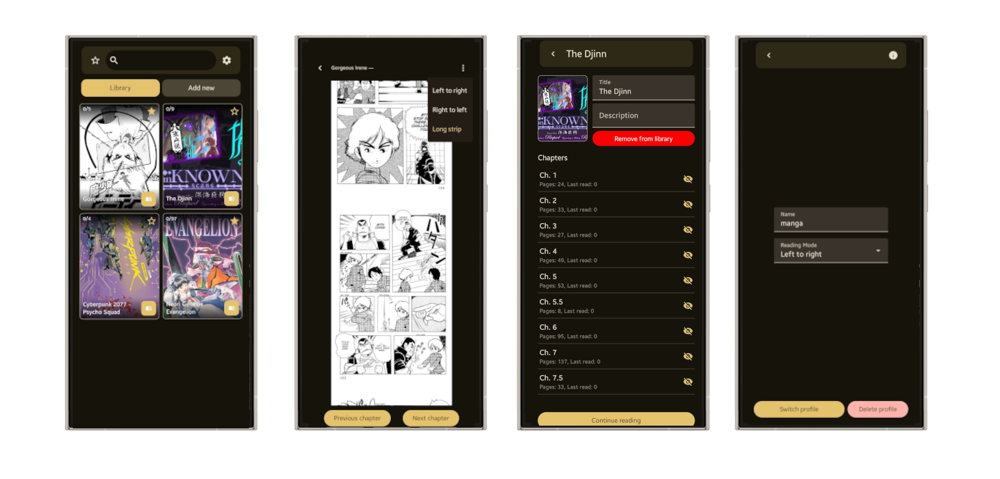

# Mangaself
Local manga/comics reader for Android.

**Author:** Ondřej Hruboš (o1\_hrubos *at* utb.cz)

## About
Mangaself is a simple manga/comics library app that lets you create and manage your own collection directly on your Android device. You can use your own folders as sources.

The app supports indexing your manga manually or fetching basic metadata from [MangaDex](https://mangadex.org/). Library metadata is stored locally, while additional metadata is retrieved from the [MangaDex API](https://api.mangadex.org/). You can also self host the Mangself API and access it in the app remotely.

## Features
- Create and manage multiple profiles.
- Add manga/comics from local folders (or zip/czf files in future).
- Index manga manually or fetch metadata from MangaDex.
- Automatically track reading progress.
- Support for both local storage and remote API.

## Quick Download
The latest APK can be downloaded directly from the `packages` folder in this GitHub repository.  

> Navigate to [Releases](https://github.com/hruboson/mangaself/releases/) and select the latest `mangaself.apk` (under Assets) file for installation on your device.

## Getting Started
1. Clone the repository.
2. Open the android directory in Android Studio.
3. Optionally run the local Mangaself API using `make local`
4. Build and run the APK on your device.

## Screenshots

## Contact
For any questions or bug reports, contact **Ondřej Hruboš** at o1\_hrubos *at* utb.cz.
